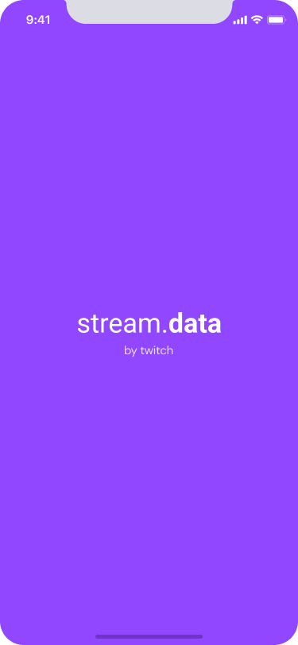
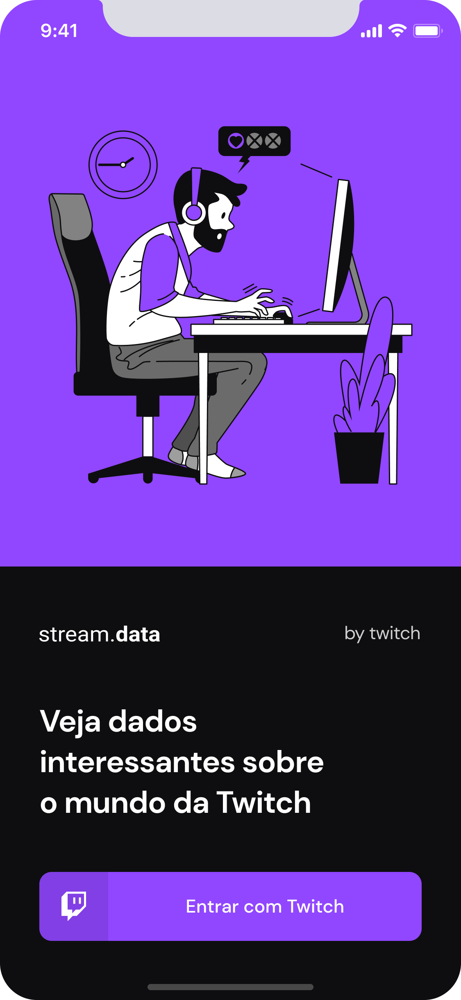
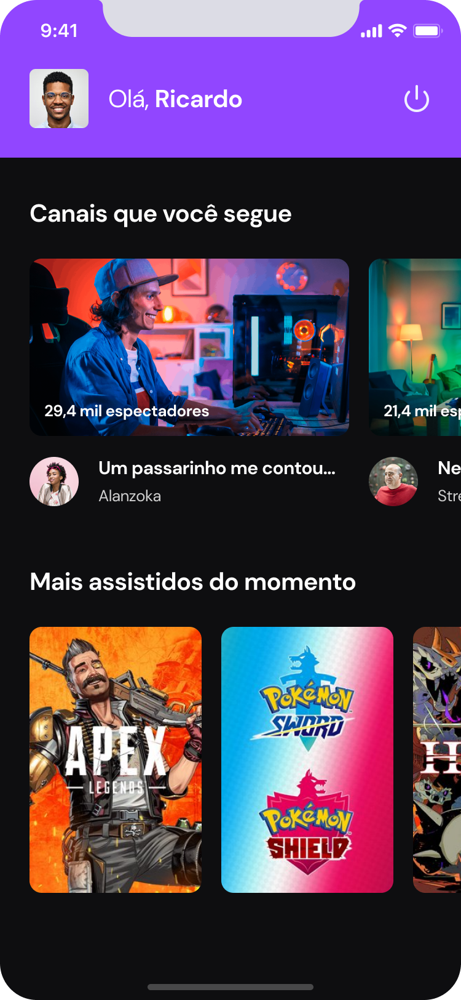

<h1 align="center">streamDATA</h1>

## Introdução

O streamDATA é um aplicativo para assistir suas listas de video da plataforma da Twitch.

É um projeto que possuí o intuíto de aplicar os conceitos de React Native aprendidos no módulo 2 do curso Ignite React Native da Rocketseat versão 2021.

<div align="center">
  
  
  
</div>

## Tecnologias 

- React Native
- Typescript
- Styled Componentss
- Twitch auth
- Context
- Axios
- Framer Motion
- Moti
- rn-placeholder


## Requisitos

- Nodejs
- Expo cli instalado na máquina local
- Aplicativo Expo Go instalado no celular
- Conta na Twitch


## Instalação

```sh
# Fazer o clone do projeto em uma máquina local
git clone https://github.com/marciovz/streamTwitch-mobile-ignite2021.git
```

```sh
# Acessa a pasta do projeto
cd streamTwitch-mobile-ignite2021
```

```sh
# Rodar a instalação das dependências do projeto
npm install
```

## Configuração

Criar um novo dispositivo na plataforma da Twitch na sessão de desenvolvedores, adicionando o nome stream.data.
Copiar o client_id gerado e adicionar no arquivo .env no projeto.

.env

```conf
# Twitch OAuth
CLIENT_ID='***ADICIONAR SEU CLIENT ID AQUI***'

```

## Rodando a aplicação

Abrir o emulador ou conectar um dispositivo para rodar a aplicação

```sh
# Rodar o bundle da aplicação.
npx expo start
```
